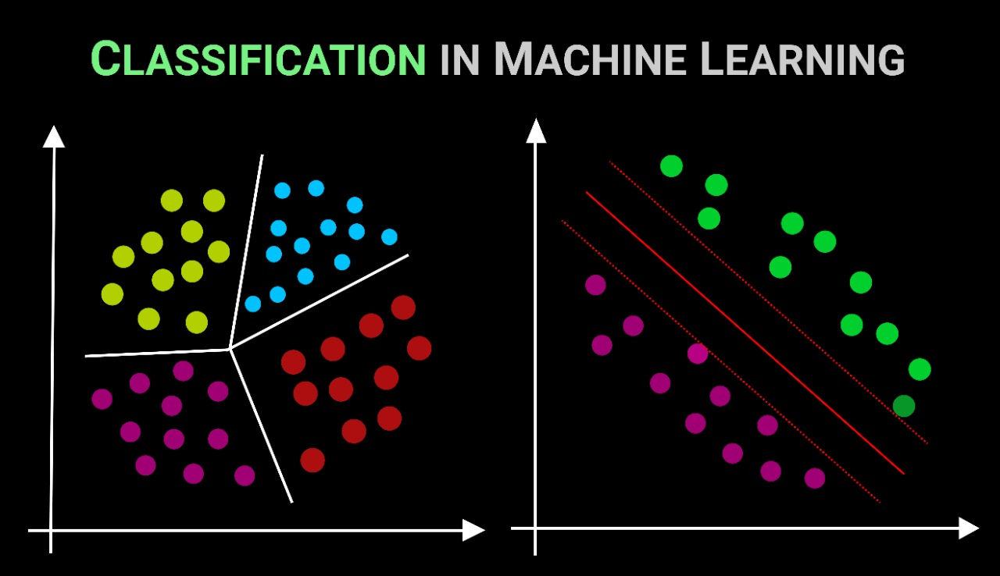

# <center> PROJECT-4. Задача классификации </center>
## Оглавление
1. [Описание проекта](#Описание-проекта)
2. [Описание данных](#Описание-данных)
3. [Зависимости](#Зависимости)
4. [Установка проекта](#Установка-проекта)
5. [Использование проекта](#Использование-проекта)
6. [Авторы](#Авторы)


## Описание проекта

__Бизнес-задача__: определить характеристики, по которым можно выявить клиентов, более склонных к открытию депозита в банке, и за счёт этого повысить результативность маркетинговой кампании.

__Техническая задача__: построить модель машинного обучения, которая на основе предложенных характеристик клиента будет предсказывать, воспользуется он предложением об открытии депозита или нет.

Проект состоит из четырех частей:

* Первичная обработка данных
* Разведывательный анализ данных (EDA)
* Отбор и преобразование признаков
* Решение задачи классификации: логистическая регрессия и решающие деревья
* Решение задачи классификации: ансамбли моделей и построение прогноза


**О структуре проекта:**
* [data](./data) - папка с исходными табличными данными
* [visualization](./visualization) - папка с изображениями, необходимыми для проекта 
* [Project4](./Project_4_ML.ipynb) - jupyter-ноутбук, содержащий основной код проекта, в котором демонстрируются методы и подходы решения задач анализа данных


## Описание данных
В нашем распоряжении реальные данные о клиентах банка. В целом их можно разделить на несколько групп.

__Данные о клиентах банка:__
* __age__ (возраст);
* __job__ (сфера занятости);
* __marital__ (семейное положение);
* __education__ (уровень образования);
* __defaul__ (имеется ли просроченный кредит);
* __housing__ (имеется ли кредит на жильё);
* __loan__ (имеется ли кредит на личные нужды);
* __balance__ (баланс).

__Данные, связанные с последним контактом в контексте текущей маркетинговой кампании:__

* __ontact__ (тип контакта с клиентом);
* __month__ (месяц, в котором был последний контакт);
* __day__ (день, в который был последний контакт);
* __duration__ (продолжительность контакта в секундах).
__Прочие признаки:__

* __campaign__ (количество контактов с этим клиентом в течение текущей кампании);
* __pdays__ (количество пропущенных дней с момента последней маркетинговой кампании до контакта в текущей кампании);
* __previous__ (количество контактов до текущей кампании)
* __poutcome__ (результат прошлой маркетинговой кампании).
И, разумеется, наша целевая переменная __deposit__, которая определяет, согласится ли клиент открыть депозит в банке. Именно её мы будем пытаться предсказать в данном кейсе.
 

## Используемые зависимости
* Python (3.9):
    * [numpy (1.23.5)](https://numpy.org)
    * [pandas (1.4.3)](https://pandas.pydata.org)
    * [matplotlib (3.4.3)](https://matplotlib.org)
    * [seaborn (0.11.2)](https://seaborn.pydata.org)
    * [plotly.express (5.15.0)](https://plotly.com/python/plotly-express/)
    * [scikit-learn (1.3.0)](https://scikit-learn.org/stable/index.html)
    * [optuna (3.1.0)](https://optuna.org/)

## Установка проекта

```
git clone https://github.com/DSPilshchikov/sf_project_4
```

## Использование
Вся информация о работе представлена в jupyter-ноутбуке Project_4.ipynb.

## Авторы

* Дмитрий Пильщиков

